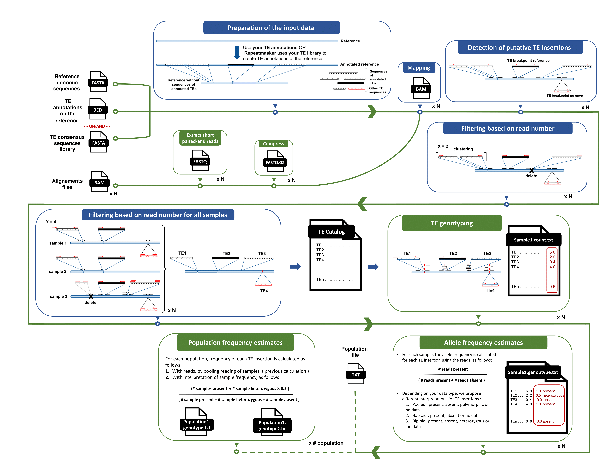

.. TEFLoN2 documentation master file, created by
   sphinx-quickstart on Wed Oct  5 11:10:24 2022.
   You can adapt this file completely to your liking, but it should at least
   contain the root `toctree` directive.

Welcome to TEFLoN2's documentation!
============================================

TEFLoN2 is an improvement of the original `TEFLoN <https://github.com/jradrion/TEFLoN>`_. Like TEFLoN, TEFLoN2 uses paired-end illumina sequence data to (1) discover transposable element (TE) insertions, (2) perform TE call (3) and estimate TE population frequency using pooled data. The original TEFLoN consisted of four python scripts that had to be run manually one by one. 

TEFLoN2 is a snakemake pipeline that can now also estimate the TE allele and population frequency for a large amount of data as single in an automatic way. This new version is therefore ideally suited to the analysis of large population datasets.

TEFLoN2 requires to prepare a specific mapping dataset (cf. figure 1.A). Then, one launches four individually automated scripts : It (cf. figure 1.B) detects all TE insertions (de novo and references TEs) based on discordant paired-end reads, then filters out low quality data to create a catalog of TE insertions. For an accurate TE genotyping, the detected TE insertions are genotyped based on discordant paired-end and split reads. Finally, TEFLoN2 estimes their allele frequency in each single data and using a population file, returns the TE population frequency.

All improvements made allow to easily up to date and launch TEFLoN2 (in one command line). TEFLoN2 can run on high performance computers (bigmem), cluster or HPC cluster.

---------------
Getting started
---------------

.. toctree::
   :caption: Getting started
   :name: getting_started
   :hidden:
   :maxdepth: 1

   getting_started/installation
   getting_started/steps_of_TEFLoN2
   getting_started/teflon2_test

.. toctree::
   :caption: Outputs ### Basic concept
   :name: output_files ### basic_concept
   :hidden:
   :maxdepth: 1 
   output_files/output_file_summary

.. toctree::
   :caption: Executing
   :name: executing
   :hidden:
   :maxdepth: 1

   executing/configure_parameter_file.rst
   executing/command_line_interface.rst

.. toctree::
   :caption: Project Info
   :name: project_info
   :hidden:
   :maxdepth: 1

   project_info/citations.rst
