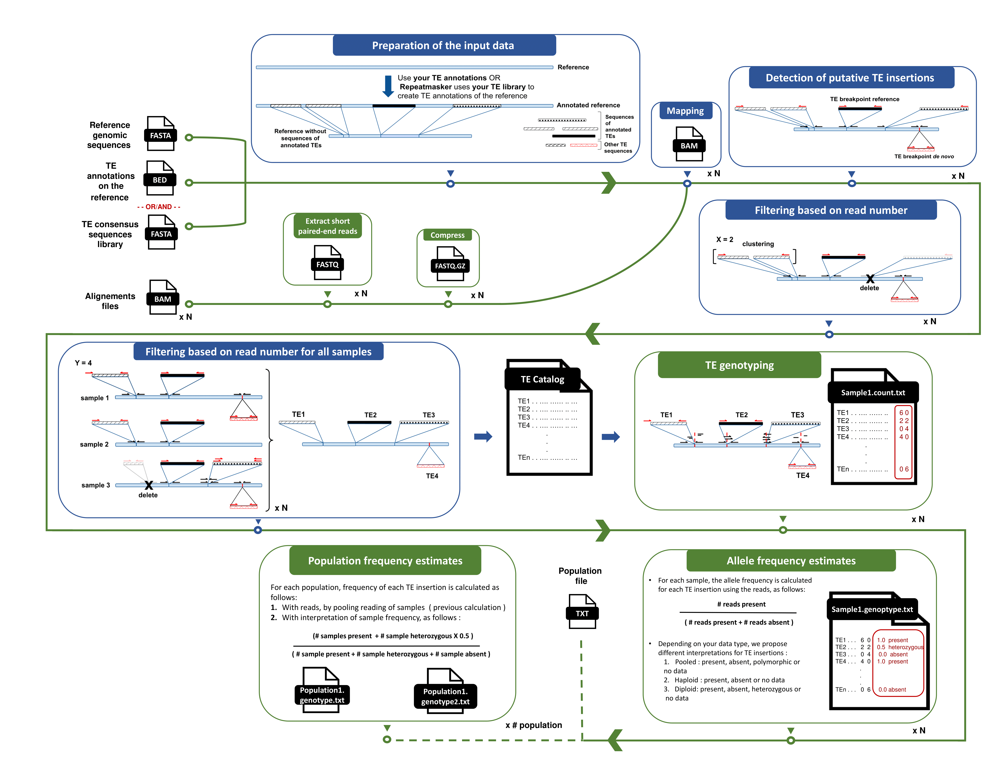

.. TEFLoN2 documentation master file, created by
   sphinx-quickstart on Wed Oct  5 11:10:24 2022.
   You can adapt this file completely to your liking, but it should at least
   contain the root `toctree` directive.

Welcome to TEFLoN2's documentation!
============================================

TEFLoN2 is an enhanced and automated version of the original TEFLoN tool. Like its predecessor, TEFLoN2 uses paired-end Illumina sequencing data to:

    Discover transposable element (TE) insertions,

    Genotype the TE insertions, and

    Estimate TE population frequencies using pooled data.

The original TEFLoN consisted of four separate Python scripts that had to be run manually in sequence. In contrast, TEFLoN2 is implemented as a Snakemake pipeline that automates these steps and scales efficiently to large datasets. This makes it particularly well suited for population-scale analyses.

To run TEFLoN2, a mapping dataset must first be prepared (see Figure 1.A). The pipeline then executes four automated modules:

    The first module (see Figure 1.B) identifies both de novo and reference TE insertions using discordant paired-end reads, and filters out low-quality data to produce a high-confidence catalog of insertions.

    The next module genotypes these TE insertions using both discordant paired-end and split reads for improved accuracy.

    Finally, TEFLoN2 estimates the allele frequency of each TE insertion in individual samples and, using a population metadata file, calculates the TE frequency across the entire population.

All improvements in TEFLoN2 make it easy to install, update, and run using a single command line. The pipeline is designed to run efficiently on high-performance workstations (bigmem), clusters, or HPC environments.

---------------
Getting started
---------------

.. toctree::
   :caption: Getting started
   :name: getting_started
   :hidden:
   :maxdepth: 1

   getting_started/installation
   getting_started/steps_of_TEFLoN2
   getting_started/teflon2_test

.. toctree::
   :caption: Outputs ### Basic concept
   :name: output_files ### basic_concept
   :hidden:
   :maxdepth: 1 
   output_files/output_file_summary

.. toctree::
   :caption: Executing
   :name: executing
   :hidden:
   :maxdepth: 1

   executing/configure_parameter_file.rst
   executing/command_line_interface.rst

.. toctree::
   :caption: Project Info
   :name: project_info
   :hidden:
   :maxdepth: 1

   project_info/citations.rst
